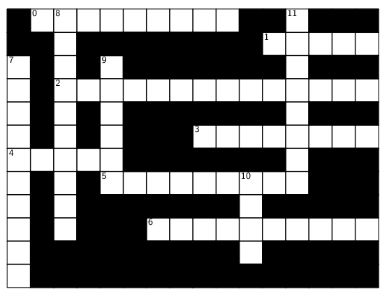
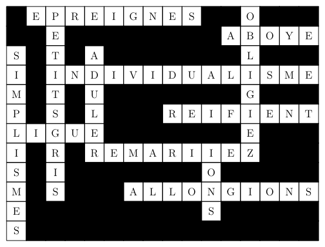

# Crossed Words

An application to create crossword puzzles. The overall objective is a program that takes a dictionary and a blank grid as inputs and produces a solved grid as output. For example, a possible empty grid is represented below. It has 12 word slots, and the first squares of each word slot are numbered from 0 to 11. We consider crossword puzzles to be provided as a grid where each square is either filled (black) or empty (white).

The goal is to enter a letter in each empty square, ensuring that all horizontal and vertical words are words from the dictionary. For example, the grid below is a solution to the given crossword puzzle. Normally, a clue is provided for each word slot, helping the crossword solver (a human) to guess the words to be placed. Here, it's the opposite: we want to generate crossword problems using our tool.

